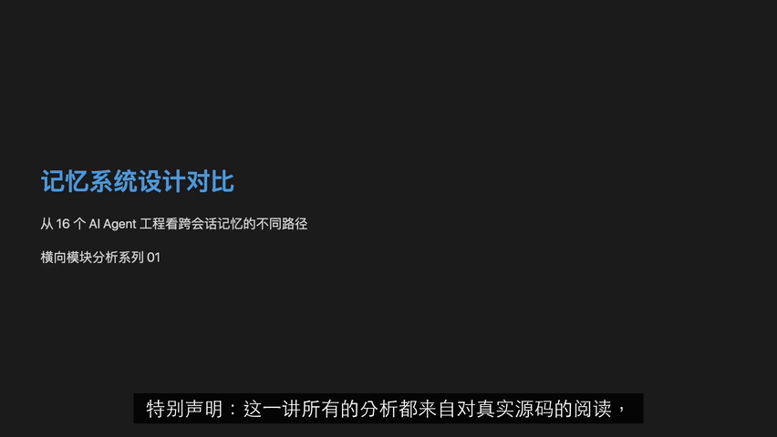
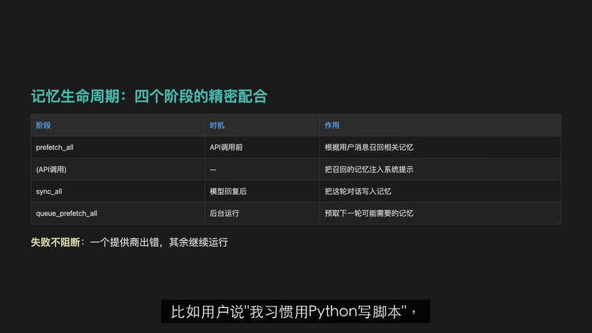
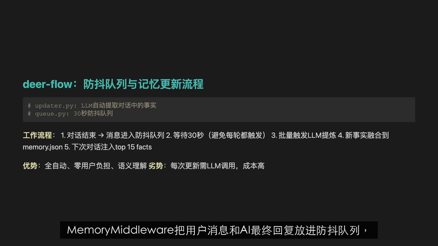
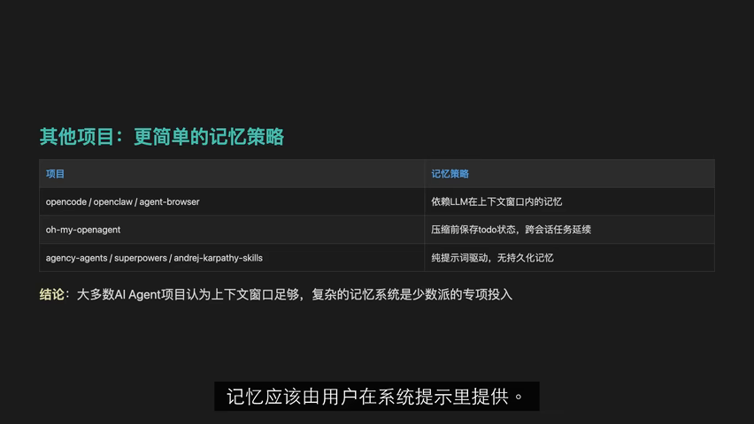
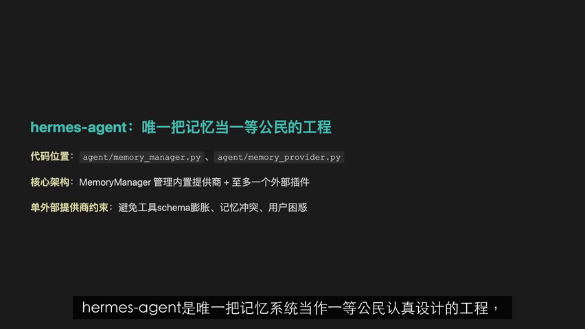

# VideoNote

> Current version: `0.2.4`
>
> License notice: VideoNote is provided only for personal study, research, evaluation, and other non-commercial use. Any form of commercialization is prohibited unless explicitly authorized in writing by the author.

VideoNote is an AI video note workspace. It turns Bilibili, YouTube, Douyin, Kuaishou, and local video files into structured Markdown notes, then enhances those notes with carefully selected screenshots from the source video.

The project is being rebuilt as an independent personal project on top of the historical BiliNote codebase. Some directory names are still inherited from the original project, such as `BillNote_frontend`, but the product direction, UI, README, screenshot workflow, and agent architecture are now focused on VideoNote.

## Why VideoNote

Most video-summary tools stop at transcript summarization. VideoNote is designed for a harder target: a note that can actually be reviewed, organized, exported, and imported into a knowledge base.

VideoNote focuses on four things:

- Generate a readable Markdown note first, so the user gets useful content quickly.
- Use the written note to decide where screenshots belong, instead of blindly sampling frames by time.
- Avoid repeated or low-value screenshots, especially long runs of images with little text between them.
- Continue the full workflow even when the video source is low resolution, while making partial screenshot issues visible.

## Real Output

The screenshots below are real VideoNote task outputs copied from this repository's generated screenshot directory. They are not legacy demo images.











## Features

- Generate structured Markdown notes from video links or local video files.
- Support Bilibili, YouTube, Douyin, Kuaishou, and local video input.
- Download video/audio with platform-specific downloader adapters.
- Use configured transcribers such as Fast Whisper, Groq, Bcut, Kuaishou, or MLX Whisper.
- Generate chaptered notes with time anchors, table of contents, source-video links, and AI summaries.
- Build a visual inventory from the video, then insert screenshots according to the Markdown content.
- Run screenshot enhancement asynchronously after the base note is saved.
- Export Markdown, HTML, DOCX, PDF, and ZIP bundles.
- Preserve image accessibility better by using ZIP or document exports when moving notes to other tools.
- Provide RAG-style Q&A over generated notes and transcripts.
- Manage LLM providers, models, transcriber settings, cookies, proxies, and system status in the UI.
- Provide a browser extension for starting notes directly from video pages.
- Keep partial failures visible instead of returning a fake success.

## Screenshot Strategy

VideoNote does not use a fixed screenshot count.

The current screenshot workflow is:

1. Generate the base Markdown note.
2. Scan the video and build a visual inventory.
3. Read each Markdown section and identify where visual evidence would help.
4. Map relevant document lines to nearby transcript time windows and visual candidates.
5. Capture candidate frames around those times.
6. Score candidates for clarity, information density, blank content, blur, and near-duplicates.
7. Insert screenshots back into the Markdown asynchronously.
8. Collapse repeated or overly dense image runs so the final note remains readable.

This means a dense technical section can receive several screenshots, while a short section with little supporting prose should usually receive one or two at most.

## Agent Architecture

VideoNote uses a coordinated set of agents and services rather than a single monolithic note generator.

```text
User input
  -> NoteGenerator
  -> PlanExecutor
  -> downloader / transcriber / LLM
  -> base Markdown note
  -> VisualInventoryAgent
  -> VisualScreenshotAgent
  -> VisualEnhancementService
  -> final Markdown with screenshots
  -> export / preview / Q&A
```

Main roles:

- `NoteGenerator`: task entry point for download, transcription, note generation, persistence, and status updates.
- `PlanExecutor`: executes the generation plan and makes long-running work easier to observe.
- `VisualInventoryAgent`: scans video frames and keeps useful visual candidates.
- `VisualScreenshotAgent`: decides which Markdown sections need screenshots, chooses timestamps, captures frames, filters duplicates, and inserts images.
- `VisualEnhancementService`: saves the base note first, then writes screenshot enhancements back asynchronously.
- `MarkdownComposerAgent`: keeps final Markdown structure, source links, screenshots, and summaries coherent.

The current design is intentionally practical: LangGraph is used where graph-style state flow helps, but the project does not add LangChain or LangGraph only for appearance.

## Project Structure

```text
backend/              FastAPI backend for downloading, transcription, generation, screenshots, export, and task state
BillNote_frontend/    React + Vite frontend for generation, history, preview, settings, export, and progress
BillNote_extension/   Browser extension for starting VideoNote from video pages
docs/assets/          README screenshots generated by the current VideoNote workflow
doc/                  Historical design notes and legacy reference material
config/               Local configuration
note_results/         Local generated task results
```

## Requirements

- Python 3.11
- Node.js 20+
- pnpm
- FFmpeg
- Anaconda environment `play` is recommended on Windows
- A configured LLM provider and model
- Optional platform cookies for higher-quality video download on sites that require login

## Quick Start

On Windows, the easiest way to start the web app is:

```bat
start-dev.bat
```

Default addresses:

- Frontend: `http://127.0.0.1:3015`
- Backend: `http://127.0.0.1:8483`
- API docs: `http://127.0.0.1:8483/docs`

If port `8483` or `3015` is already occupied, close the old backend/frontend terminal windows first, or stop the old processes before starting again.

## Manual Development

Backend:

```bash
cd backend
pip install -r requirements.txt
python main.py
```

Frontend:

```bash
cd BillNote_frontend
pnpm install
pnpm dev
```

Browser extension:

```bash
cd BillNote_extension
pnpm install
pnpm dev
```

Then load `BillNote_extension/extension/` as an unpacked extension in the browser.

## Configuration

Common environment variables:

- `BACKEND_PORT`: backend port, default `8483`
- `FRONTEND_PORT`: frontend port, default `3015`
- `FFMPEG_BIN_PATH`: custom FFmpeg path
- `TRANSCRIBER_TYPE`: transcriber type, such as `fast-whisper` or `groq`
- `WHISPER_MODEL_SIZE`: Whisper model size, such as `medium`
- `OUT_DIR`: screenshot output directory
- `IMAGE_BASE_URL`: image URL prefix used in Markdown
- `SCREENSHOT_REVIEW_MODE`: optional vision review mode, default `off`
- `SCREENSHOT_CANDIDATE_LIMIT`: screenshot candidate limit
- `SCREENSHOT_COMFORT_MAX_PER_SECTION`: comfortable per-section screenshot cap, default `3`

LLM API keys should be configured from the frontend settings page when possible.

## Export Notes

Markdown image handling matters.

Plain Markdown stores text and image references. If those image references point to a local backend URL, other apps may not be able to load the images after the backend is closed or screenshots are cleaned.

Recommended export choices:

- Use ZIP when you want Markdown plus local image files together.
- Use HTML, DOCX, or PDF when you need a self-contained document-like result.
- Use plain Markdown only when the target system can also access the referenced images.

This is especially important when importing notes into tools such as Notion, Obsidian, or other knowledge-base systems.

## Testing

Backend focused tests:

```bash
cd backend
pytest
```

Frontend:

```bash
cd BillNote_frontend
pnpm build
pnpm lint
```

Browser extension:

```bash
cd BillNote_extension
pnpm build
pnpm typecheck
pnpm test
```

The current screenshot and agent workflow is covered by focused tests around visual planning, screenshot density, partial success, cache recovery, and quality benchmarking.

## Current Focus

VideoNote is still under active reconstruction. The most important engineering priorities are:

- Better screenshot precision against real long videos.
- Faster end-to-end generation.
- More stable failure recovery.
- Clearer frontend progress feedback.
- Better export packaging for Markdown plus images.
- Cleaner separation between inherited BiliNote structure and new VideoNote design.

## Non-Commercial Use Only

This project may be used only for personal learning, research, evaluation, and non-commercial self-use.

Without explicit written permission from the author, the following are prohibited:

- Commercial deployment
- Commercial SaaS
- Paid API service
- Paid courses, training, delivery, or consulting based on this project
- Paid hosting, operation, or note-generation service
- Resale, paid distribution, or paid repackaging
- Use as part of a commercial product, commercial plugin, or commercial platform

This repository contains historical code and structure derived from the open-source BiliNote project. The original MIT copyright notice is preserved in `LICENSE` and `NOTICE`. New VideoNote-specific customization in this repository is subject to the non-commercial restriction described above.
